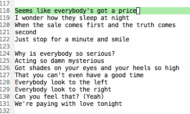
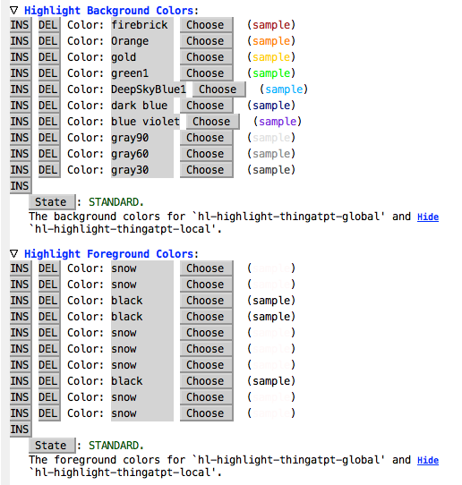
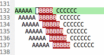
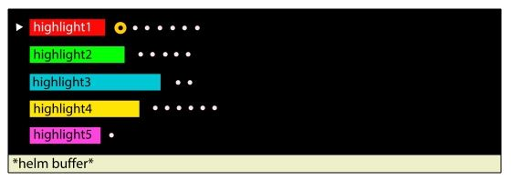

[](http://melpa.org/#/hl-anything)
[](http://stable.melpa.org/#/hl-anything)
[](https://travis-ci.org/boyw165/hl-anything)

Highlight Symbols, Selections, Enclosing Parens and More
===================================================================

[](https://gitter.im/hl-anything/hl-anything-emacs?utm_source=badge&utm_medium=badge&utm_campaign=pr-badge&utm_content=badge)

Highlight things at point, selections, enclosing parentheses with different colors. **Fix grumbling issue of highlights being overridden by** `hl-line-mode` **and** `global-hl-line-mode`.

Demo
----


Basic Usage - First Step, Enable `hl-highlight-mode`
----------------------------------------------------
There're **GLOBAL** and **LOCAL** kinds of highlights.
The global highlights appear in every buffer; The local highlights only exist in the current buffer.


Global Highlights:

* Command **`hl-highlight-thingatpt-global`** to toggle global highlight at point or selection.
* Command **`hl-unhighlight-all-global`** to remove all global highlights.

Local Highlights:

* Command **`hl-highlight-thingatpt-local`** to toggle local highlight at point or selection.
* Command **`hl-unhighlight-all-local`** to remove all local highlights.

You can change foreground and background colors of highlights:

* Foreground colors are stored in `hl-highlight-foreground-colors` variable.
* Background colors are stored in `hl-highlight-background-colors` variable.



Turn Highlight On/Off
---------------------
`M-x` **`hl-global-highlight-on/off`** to turn highlight on or off!

Example:


Search Highlights
-----------------
Put your cursor on the highlight and use following commands to search highlights.

`M-x` **`hl-find-next-thing`** and **`hl-find-prev-thing`** to go through highlights.



Save & Restore Highlights
-------------------------
Once `hl-highlight-mode` is on, it will save highlights automatically before Emacs exits.
It will also try to restore highlights when Emacs opens.

* `M-x` **`hl-save-highlights`** to save highlights; `M-x` **`hl-restore-highlights`** to restore highlights.
* Saved file-path is stored in `hl-highlight-save-file` variable.

Parenthese Highlight, `hl-paren-mode`
-------------------------------------


* Colors of outward parentheses are stored in `hl-outward-paren-fg-colors` and `hl-outward-paren-bg-colors` variables.
* Colors of inward parentheses are stored in `hl-inward-paren-fg-color` variables.

Advanced - `hl-highlight-special-faces`
---------------------------------------
This is a special faces storage. The faces storing here are always on the top of the current line highlight (`hl-line-mode` and `global-hl-line-mode`).


Example:

```lisp
;; 'YOUR-FACE will never be hidden by current line highlight.
(add-to-list 'hl-highlight-special-faces 'YOUR-FACE t)
```

TODO
----
* Highlight Enclosing syntax in Emacs REGEX.
* Integrate with `helm` to give ability to navigate highlights.

* Define all the parenthesis pairs using a variable that can be highlighted. [issue#8](https://github.com/boyw165/hl-anything/issues/8)

Contribution
------------
Forks and pull requests are welcome!

